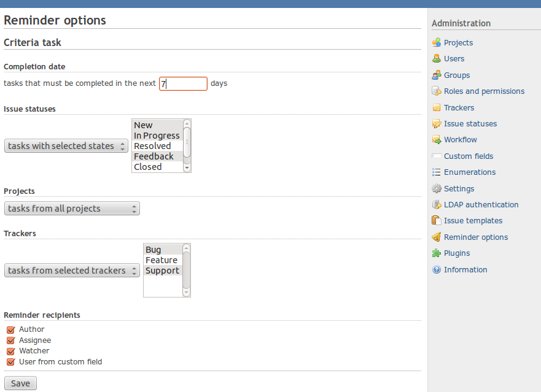

# Advanced Redmine Notifications

E-mail notification of issues due date you are involved in (Assignee, Author, Watcher, Custom field)

## Install

1. Copy plugin directory into #{RAILS_ROOT}/plugins.
If you are downloading the plugin directly from GitHub,
you can do so by changing into your plugin directory and issuing a command like

        git clone https://github.com/Restream/redmine_reminder

2. Run the following command to upgrade your database (make a db backup before).

        bundle exec rake redmine:plugins:migrate RAILS_ENV=production

3. Restart Redmine

You can also follow plugin installation procedure at http://www.redmine.org/wiki/redmine/Plugins.

## Usage

The plugin runs as a rake task so you have to set it up in cron or task sheduler

1 0 * * *       root    cd /opt/redmine && rake redmine:send_reminders_all RAILS_ENV=production

You can setup options in administration menu.

## Compatibility

This version supports redmine 4.x.
